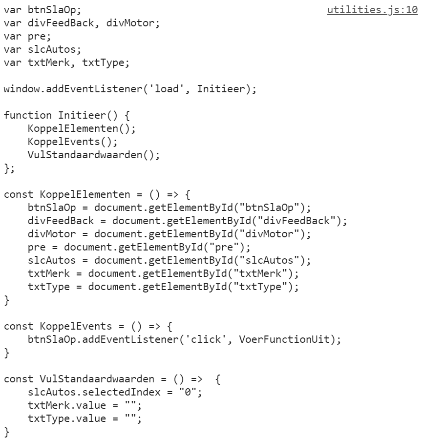

# DOM-elementen ophalen en de basis voor je js-bestand aanmaken
## function MaakKoppelingsCode
Deze function voert de volgende taken uit:
- alle DOM-elementen uit de body in een array opslaan
- de bovenstaande array alfabetisch sorteren op id
- een call uitvoeren naar StelJsTekstSamen
- de return van deze call tonen in de console.

## function GeefChildren
Op basis van een doorgegeven DOM-element en een array waarin de geselecteerde DOM-elementen opgeslagen moeten worden, voert deze function de volgende acties uit:
- de id's van de children van het DOM-element, opslaan in de opgegeven array, voor zover ze er nog niet in voorkomen. 
  In dat laatste geval volgt er een boodschap in de console.
- bij deze children worden via recursieve programmatie ook de id's van eventuele children opgehaald

## StelJsTekstSamen
Op basis van de array met de id's wordt er in de console een tekst getoond gelijkaardig aan de onderstaande:

Hiervoor gebruiken we de volgende functions:

### GeefDeclaraties
Maakt een declaratie van een globale variabele aan voor elk DOM-element met een id op basis van de array die als parameter meegegeven wordt.
De declaraties zijn verzameld per type van DOM-element op basis van de prefixen die uit 3 karakters bestaan.

### GeefKoppelingen
Maakt de function KoppelElementen aan op basis van de array die als parameter meegegeven wordt.

### GeefButtonEventKoppelingen
Maakt de function KoppelEvents aan op basis van de array die als parameter meegegeven wordt. Voor elke button wordt een event listener voor het click-event aangemaakt, met een call naar VoerFunctionUit.

### VulStandaardwaarden
Maakt de function VulStandaardwaarden aan op basis van de array die als parameter meegegeven wordt.
- Voor een id met prefix 'txt' is de standaard een lege string
- Voor een id met prefix 'slc' is de standaard een nul

